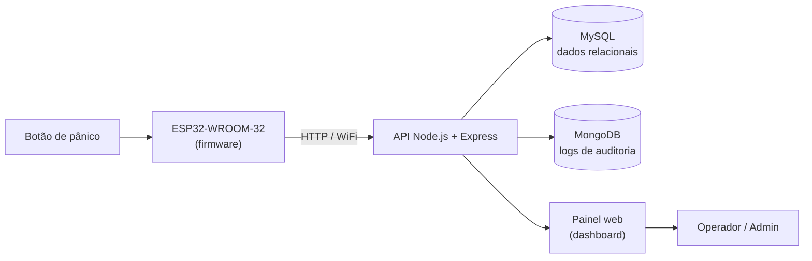
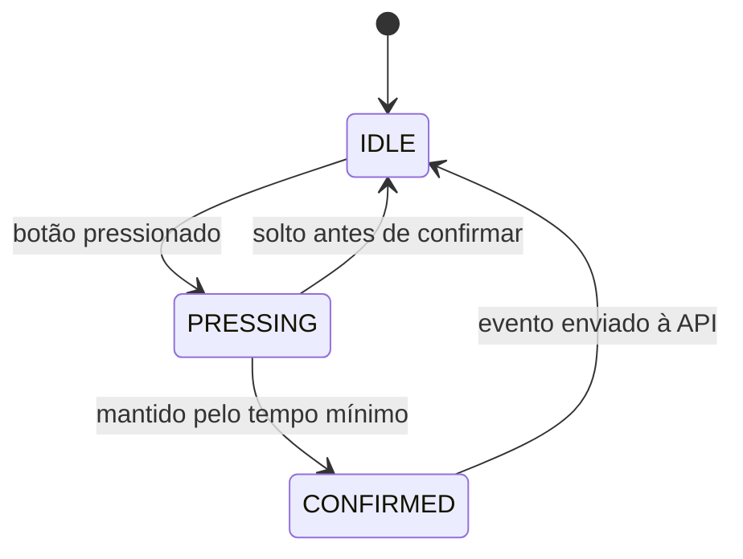

[README.md](https://github.com/user-attachments/files/28917876/README.md)
# PanicIoT

Sistema full-stack de botão de pânico IoT. Um dispositivo baseado em **ESP32-WROOM-32** detecta acionamentos de emergência e os envia, via WiFi, para uma **API REST** que autentica, registra e audita cada evento — disponibilizando tudo em tempo real num **painel web** para operadores e administradores.


> Projeto desenvolvido na disciplina de **Projetos II** — Engenharia da Computação, UNIVAP. Artigo submetido ao **INIC 2025**.

---

## Sumário

- [Arquitetura](#arquitetura)
- [Estrutura do repositório](#estrutura-do-repositório)
- [Backend (API)](#backend-api)
- [Firmware (ESP32)](#firmware-esp32)
- [Banco de dados](#banco-de-dados)
- [Autor](#autor)

---

## Arquitetura

O sistema tem três partes que conversam entre si:



O **firmware** roda uma máquina de estados que evita acionamentos acidentais e envia um *heartbeat* periódico para sinalizar que o dispositivo está vivo. O **backend** segue uma arquitetura em camadas (MVC + Service + DAO):

```
Requisição → Rota → Middleware (auth · validação · log · erro)
           → Controller → Service (regra de negócio)
           → DAO (acesso a dados) → MySQL / MongoDB
```

As interfaces (`IController`, `IService`, `IDAO`) definem os contratos de cada camada, mantendo a separação de responsabilidades.

### Máquina de estados do dispositivo



O estado é persistido em **NVS**, sobrevivendo a reinicializações do ESP32.

---

## Estrutura do repositório

```
paniciot/
├── backend/                  # API Node.js/Express + painel web
│   ├── public/               # Frontend (HTML/CSS/JS, tema escuro)
│   │   ├── css/              # estilos
│   │   ├── js/               # api.js, nav.js
│   │   └── *.html            # login, dashboard, events, devices, users, reports...
│   ├── sql/                  # schema.sql (tabelas) + seeds.sql (dados iniciais)
│   ├── src/
│   │   ├── routes/           # rotas da API
│   │   ├── controllers/      # camada de controle
│   │   ├── services/         # regra de negócio
│   │   ├── models/           # DAOs (acesso a dados)
│   │   ├── middleware/       # auth, deviceAuth, validation, log, error
│   │   ├── interfaces/       # contratos (IController, IService, IDAO)
│   │   ├── db/               # conexões MySQL e MongoDB
│   │   └── utils/            # utilitários (ex.: xmlExporter)
│   ├── index.js              # ponto de entrada da aplicação
│   ├── reset-admin.js        # utilitário: recria/reseta o usuário admin
│   ├── test-db.js            # utilitário: testa a conexão com o banco
│   └── package.json
└── firmware/                 # Firmware do ESP32 (PlatformIO / Arduino)
    ├── src/
    │   ├── config.h          # WiFi, endereço do servidor e pinos
    │   └── main.cpp
    └── platformio.ini
```

---

## Backend (API)

### Tecnologias
- **Node.js + Express** — servidor e roteamento
- **MySQL (XAMPP)** — dados relacionais (usuários, dispositivos, eventos, zonas...)
- **MongoDB** — logs de auditoria
- **JWT + bcrypt** — autenticação e hash de senhas
- **Chart.js + jsPDF** — gráficos e geração de PDF no painel

### Funcionalidades
- Autenticação via **JWT** com senhas protegidas por **bcrypt**
- Controle de acesso por papel: **ADMIN** e **OPERADOR**
- Autenticação dedicada para os dispositivos ESP32 (`deviceAuthMiddleware`)
- Registro de eventos de pânico e das ações tomadas sobre cada um
- **Auditoria** completa das operações em MongoDB
- Exportação de dados em **JSON, XML e PDF**
- Painel web em tema escuro com dashboard, gráficos e relatórios

### Como rodar

```bash
cd backend
npm install
```

Crie o arquivo `.env` na raiz de `backend/` (exemplo — ajuste aos seus valores):

```env
PORT=3000

# MySQL
DB_HOST=localhost
DB_PORT=3306
DB_USER=root
DB_PASSWORD=sua_senha
DB_NAME=paniciot

# MongoDB
MONGO_URI=mongodb://localhost:27017/paniciot

# Autenticação
JWT_SECRET=uma_chave_secreta_forte
```

Crie o banco e carregue as tabelas e os dados iniciais:

```bash
# dentro do MySQL: CREATE DATABASE paniciot;
mysql -u root -p paniciot < sql/schema.sql
mysql -u root -p paniciot < sql/seeds.sql
```

Suba o servidor:

```bash
npm start
```

A aplicação fica disponível em **http://localhost:3000**. Faça login com o usuário admin criado pelo `seeds.sql`.

Scripts úteis:

```bash
node test-db.js       # testa a conexão com o banco
node reset-admin.js   # recria/reseta o usuário administrador
```

### Grupos de rotas

| Módulo (`src/routes/`) | Responsabilidade |
| --- | --- |
| `authRoutes` | login e emissão de token JWT |
| `userRoutes` | gestão de usuários (ADMIN) |
| `deviceRoutes` | cadastro e autenticação dos dispositivos ESP32 |
| `eventRoutes` | recebimento e consulta de eventos de pânico |
| `zoneRoutes` | gestão de zonas |
| `logRoutes` | consulta dos logs de auditoria |
| `reportRoutes` | geração de relatórios |
| `exportRoutes` | exportação em JSON / XML / PDF |

---

## Firmware (ESP32)

### Hardware
- **ESP32-WROOM-32**
- Botão físico de pânico
- Pinos e periféricos definidos em `src/config.h`

### Tecnologias
- **PlatformIO** com framework **Arduino**

### Funcionamento
O dispositivo conecta-se ao WiFi, registra-se na API e entra na máquina de estados `IDLE → PRESSING → CONFIRMED`. O passo de confirmação (segurar o botão por um tempo mínimo) evita disparos acidentais. Ao confirmar, envia o evento para a API; em paralelo, emite um *heartbeat* periódico para indicar que está online. A configuração persiste em **NVS**.

### Como compilar e gravar

Configure suas credenciais em `src/config.h` (exemplo — ajuste aos nomes reais do seu arquivo):

```cpp
#define WIFI_SSID      "sua_rede"
#define WIFI_PASSWORD  "sua_senha"

#define SERVER_HOST    "192.168.0.100"   // IP da máquina rodando a API
#define SERVER_PORT    3000
```

Compile, grave e abra o monitor serial (via PlatformIO):

```bash
cd firmware
pio run --target upload
pio device monitor
```

Ou use os botões **Build / Upload / Monitor** da extensão PlatformIO no VS Code.

---

## Banco de dados

- **MySQL** — seis tabelas relacionais cobrindo usuários, dispositivos, eventos, ações de evento e zonas. Estrutura em `sql/schema.sql`; dados iniciais (incluindo o usuário admin) em `sql/seeds.sql`.
- **MongoDB** — armazena os logs de auditoria das operações da API.

---

## Autor

Desenvolvido por **[@GabrielVsmmAndrade](https://github.com/GabrielVsmmAndrade)** — Engenharia da Computação, UNIVAP.
Projeto acadêmico da disciplina de Projetos II, com artigo submetido ao INIC 2025.
